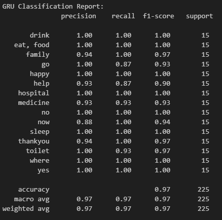
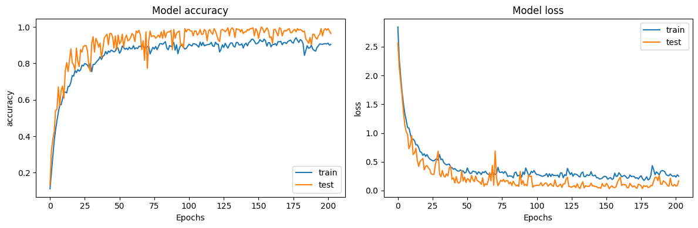
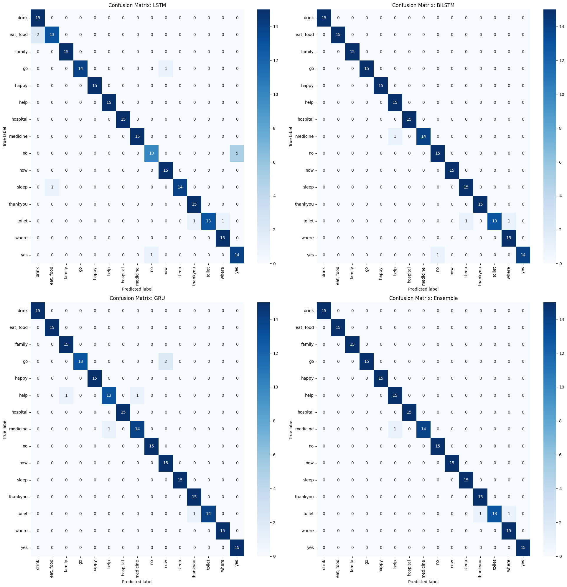

# Real-Time Malaysian Sign Language (BIM) Recognition System

## 📖 Overview
This project is a real-time Malaysian Sign Language (BIM) to text translator. It leverages computer vision and deep learning to bridge the communication gap between the deaf/hard-of-hearing community and non-signers in Malaysia.

The custom dataset consists of 15 dynamic BIM gestures, with 150 video samples per gesture, totaling 2,250 labeled sequences. All data was self-recorded and annotated based on the Malaysian Sign Language (BIM) SignBank.

Using a standard webcam, the system captures a user's **dynamic gestures** and translates them into text. Developed as a Final Year Project, this system focuses on being practical, low-cost, and accessible.

---

## Key Features
- 🔁 **Real-Time Translation**: Converts dynamic BIM gestures to text with minimal delay.
- 🎥 **Vision-Based**: Works with just a standard webcam—no sensor gloves needed.
- ✅ **High Accuracy**: Achieved up to **98.67%** accuracy; deployed GRU model reached **97.33%**.
- 🖐️ **15 Dynamic Gestures**: Designed for conversational signs, not just static letters.
- 🖥️ **User-Friendly Interface**: Simple GUI built with **Tkinter**.

---

## ⚙️ Technology Stack

**Language:** Python 3.12  
**Core Libraries:**
- `TensorFlow` & `Keras` – Deep learning model training & inference  
- `OpenCV` – Real-time video capture and image processing  
- `MediaPipe` – Real-time keypoint extraction (hands, face, pose)  
- `scikit-learn` – Data splitting and evaluation  
- `Tkinter` – Graphical User Interface (GUI)  
- `NumPy` – Numerical data structuring

---

## ▶️ How to Run

### 1. Model Training & Evaluation (`FYP RNN.ipynb`)

This Jupyter notebook contains the full workflow:

* **Data Collection**: Captures and processes new gesture data.
* **Model Training**: Trains three RNNs — LSTM, BiLSTM, GRU.
* **Evaluation**: Uses accuracy/loss curves, classification reports, and confusion matrices.

> 📁 Dataset should be stored in the `Action_Dataset/` directory before training.

### 2. Real-Time Application (`sign_language_gui.py`)

This is the final deployable GUI application.

#### ✅ Requirements:

* `model3.h5` – Trained GRU model.
* `Action_Dataset/` – Directory containing action labels.

#### 🕹️ Usage:

* Click **Start** to begin detection.
* Perform BIM gestures in front of your webcam.
* Press **'q'** in the video window to stop.
* Click **Quit** to exit the app.

---

## 🧠 Model Architecture & Performance

* **Feature Extraction**: MediaPipe Holistic generates 1662 keypoints per frame (pose + face + hands).
* **Sequence**: Each gesture is represented by a sequence of 30 frames.
* **Dataset Split**: The dataset was split into 80% training, 10% validation, and 10% testing.

### 📊 Model Comparison

| Model    | Test Accuracy | Description                         |
| -------- | ------------- | ----------------------------------- |
| LSTM     | 94.67%        | Baseline RNN for sequences          |
| BiLSTM   | 98.22%        | Captures bidirectional context      |
| GRU      | 97.33%        | Efficient and accurate (Deployed)   |
| Ensemble | 98.67%        | Combines all three for max accuracy |

> 🎯 **GRU** was selected for real-time deployment due to its balance of speed and performance.

---

## 📈 Results

### ✅ Model Evaluation

* GRU achieved **97.33% accuracy** on unseen test data.
* This model achieved a weighted average F1-score of **0.98**.
* Stable training curve, no signs of overfitting.

---

## 🔮 Future Work

* **Expand Vocabulary**: Add more gesture classes.
* **Mobile App**: iOS/Android deployment for accessibility.
* **Environmental Robustness**: Improve under various lighting/backgrounds.

---
